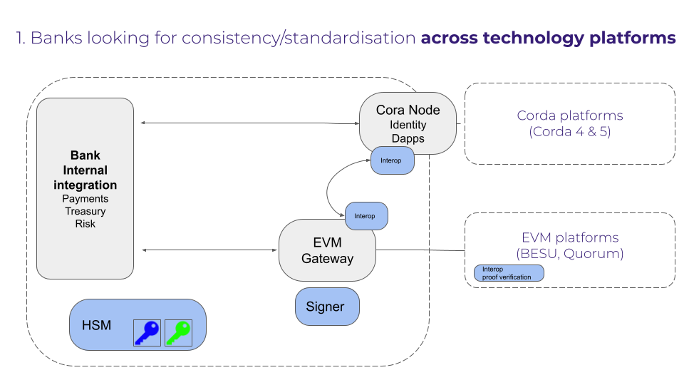

# Bank Side patterns

## Introduction 
Banks are looking for consistency and standardisation when it comes to connecting to different digital platforms and manageing interoperability between different settlement legs.

At a simplistic level, banks will be running gateways to different platforms.  These gateways could be using different technologies.  Below is an image showing the generic components that banks will need to manage.  The image is showing a corda gateway and an enterprise ethereum gateway, but this pattern can be extended to other technology stacks.

