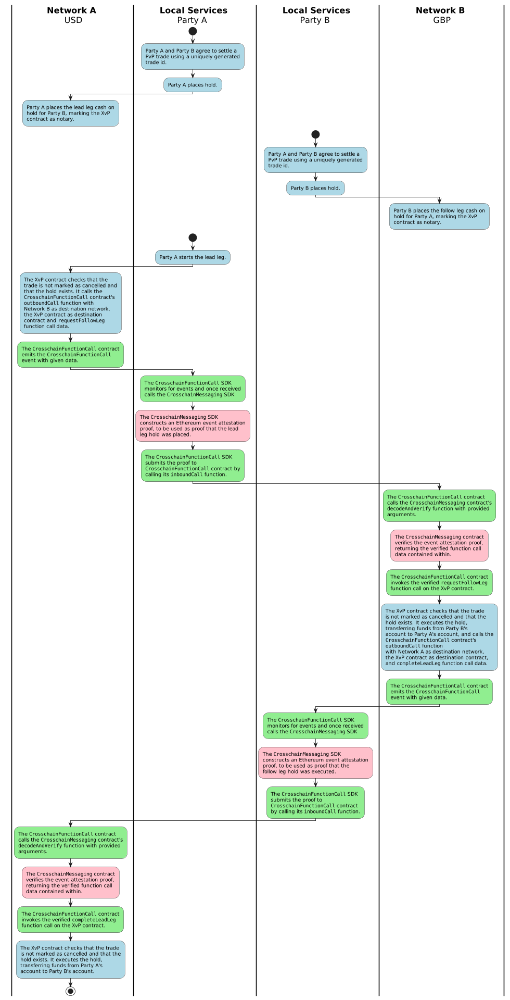
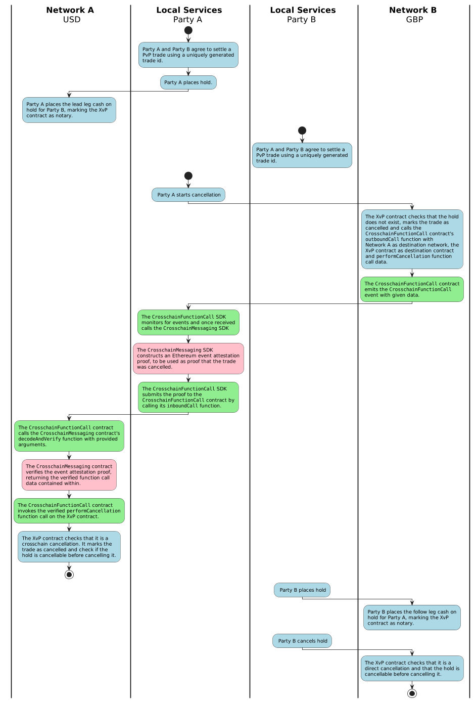
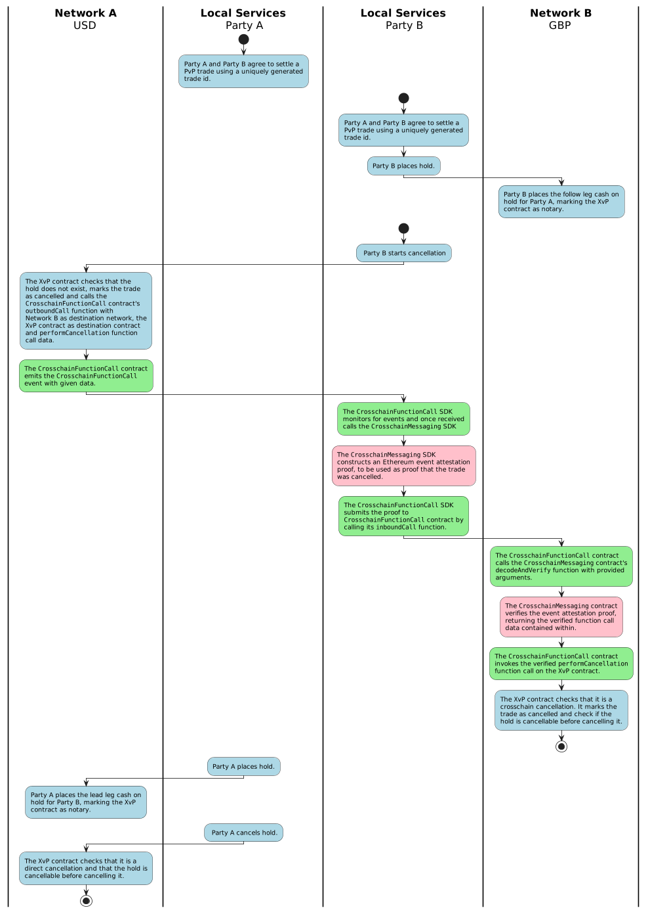
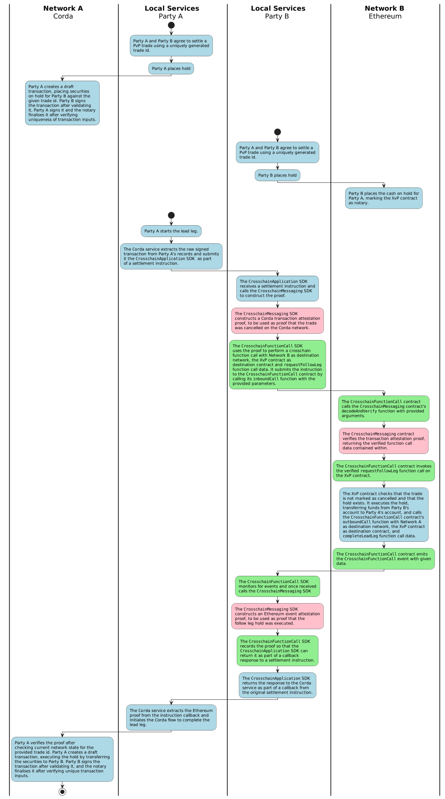
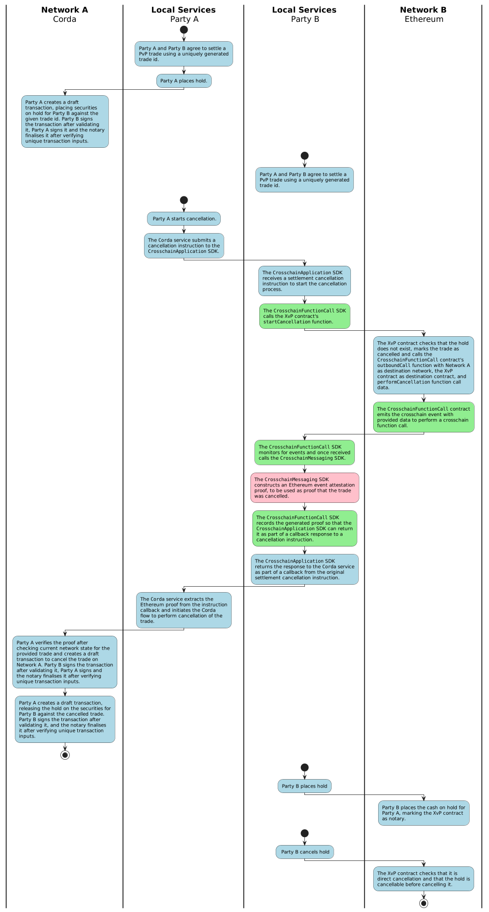
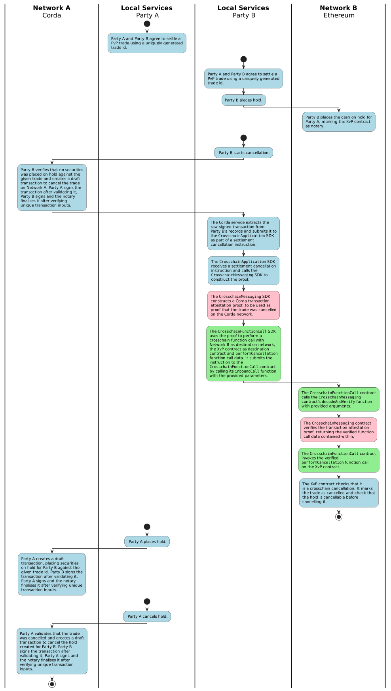

# Crosshain Interoperability 

## Introduction

The [Crosschain DLT Interoperability Specification](https://entethalliance.github.io/crosschain-interoperability/draft_dlt-interop_techspec.html) is a formal definition of the implementation requirements for Enterprise Ethereum clients to achieve scalable crosschain communications.

The definition of the protocol stack consists of three layers:

where 

 - The `Crosschain Application` layer contains all business logic.
 - The `Crosschain Function Call` layer enables remote function calls across DLT networks.
 - The `Crosschain Messaging` layer enables a trustless environment concerning transactions and events that are generated on one network and needs to be trusted on another network.

The design of the architecture, protocols, and interfaces is in alignment with the standards set by the Enterprise Ethereum Alliance (EEA), with the specifications defined in the three layers of the protocol stack.

## General use cases

The crosschain application layer XvP (PvP/DvP) smart contract implementation is based on a leader-follower approach in which one network is the leading network and the other is the follower network. Atomic settlement, in the financial sense, is achieved by ensuring that either both legs complete successfully or none does, in which case the trade is cancelled.

### PvP

The crosschain Payment versus Payment (PvP) flows discussed here involve payments taking place across two Ethereum networks.

The crosschain PvP cash settlement flows make use of earmarks, where cash are placed on hold with the intent to transfer it to the entity it was earmarked for after receiving sufficient proof that a previous step in the PvP flow was executed.

The general crosschain PvP settlement use case flow for a successful trade is outlined below:

1. Party A and Party B agree to settle a PvP trade via off-chain orchestration.
2. Party B places the follow leg cash on hold for Party A, marking the XvP contract as notary on the follower Ethereum network.
3. Party A places the lead leg cash on hold for Party B, marking the XvP contract as notary on the leading Ethereum network.
4. Party A starts the lead leg on the leading Ethereum network, which will emit an event with a crosschain function call instruction to request the follow leg if, and only if, the lead leg hold is in place.
5. Party A constructs an Ethereum event attestation proof, using it as proof that the lead leg hold was placed on the leading Ethereum network.
6. Party A executes a crosschain function call on the follower Ethereum network to request the follow leg which, after successful verification of the proof, emits an event with a crosschain function call instruction to complete the lead leg if, and only if, the follow leg hold was executed. Party A receives the cash on the follower Ethereum network.
7. Party B constructs an Ethereum event attestation proof, using it as proof that the follow leg hold was executed on the follower Ethereum network.
8. Party B executes the crosschain function call on the leading Ethereum network to complete the lead leg which, after successful verification of the proof, executes the lead leg hold. Party B receives the cash on the leading Ethereum network.

### DvP

The crosschain Delivery versus Payment (DvP) flows discussed here involve transferring securities on a Corda network while the corresponding payment for the securities takes place on an Ethereum network.

The crosschain DvP repo trade settlement flows make use of earmarks, where assets are placed on hold with the intent to transfer them to the entity it was earmarked for after receiving sufficient proof that a previous step in the DvP flow was executed.

The general crosschain DvP settlement use case flow for a successful trade is outlined below:

1. Party A and Party B agree to settle a DvP trade via off-chain orchestration.
2. Party B places the payment leg cash on hold for Party A, marking the XvP contract as notary on the Ethereum network.
3. Party A places the delivery leg securities on hold on the Corda network.
4. Party A constructs a Corda transaction attestation proof, using it as proof that the delivery leg hold was placed on the Corda network.
5. Party A executes a crosschain function call on the Ethereum network to request the payment leg which, after successful verification of the proof, emits an event with a crosschain function call instruction to complete the delivery leg if, and only if, the payment leg hold was executed. Party A receives the cash on the Ethereum network.
6. Party B constructs an Ethereum event attestation proof, using it as proof of the payment leg hold execution on the Ethereum network.
7. Party B executes the crosschain function call on the Corda network to complete the delivery leg which, after successful verification of the proof, executes the delivery leg hold. Party B receives the securities on the Corda network.

The flows that get executed when submitting DvP settlement instructions via the crosschain interop service deviates slightly from the standard use case. In general crosschain DvP settlement, we assume Party A and Party B have access to both the Corda and Ethereum networks. In the real world use case this was not the case which was the reason for creating the crosschain interop service for the PoC. It allows for orchestration between parties where, for example, Party A can instruct Party B to execute a crosschain function call on the Ethereum network and, via callback, receive an instruction to execute a crosschain function call on the Corda network.

The adapted crosschain DvP settlement use case flow for a successful trade is as follows:

1. Party A and Party B agree to settle a DvP trade via off-chain orchestration.
2. Party B places the payment leg cash on hold for Party A, marking the XvP contract as notary on the Ethereum network.
3. Party A places the delivery leg securities on hold on the Corda network, extracting a signed Corda transaction from the network, and submits it as part of a settlement instruction to the crosschain interop API service hosted by Party B.
4. Party B constructs a Corda transaction attestation proof, using it as proof that the delivery leg hold was placed on the Corda network.
5. Party B executes a crosschain function call on the Ethereum network to request the payment leg which, after successful verification of the proof, emits an event with a crosschain function call instruction to complete the delivery leg if, and only if, the payment leg hold was executed. Party A receives the cash on the Ethereum network.
6. Party B constructs an Ethereum event attestation proof, using it as proof of the payment leg hold execution on the Ethereum network, and send it as part of the settlement instruction callback response to Party A.
7. Party A executes the crosschain function call on the Corda network to complete the delivery leg which, after successful verification of the proof, executes the delivery leg hold. Party B receives the securities on the Corda network.

The underlying crosschain interop protocol allows for a variety of different execution models, depending on the infrastructure and deployment. The parties executing the crosschain calls can, besides access controls on the network and smart contracts, be relaxed to some extent, as the crosschain interop contracts make use of cryptographically verifiable proofs to authorise a crosschain function call, and not solely the sender of the transaction on the network.

This means that a centralised party, connected to only one of the networks, can perform crosschain function calls on behalf of the parties involved, if sufficient proof can be provided of the event or transaction on the other network involving these parties. It becomes a matter or proof generation capability and routing the corresponding crosschain function calls to a party capable of executing it on the network.

### Cancellations

The crosschain PvP/DvP cancellation flows discussed here aim at catering for the edge case where the hold for the lead (resp. delivery) leg, or follower (resp. cash) leg, can not be placed, or corrected, and in order to release the hold, the trade must be cancelled. More specifically, the hold for a trade can only be cancelled on a specific network, after the trade was cancelled on that network. And a trade can only be cancelled on a network, if the hold for that trade is not already placed on that network. This means that a trade, where the hold is already in place, can only be cancelled, through the crosschain interop protocol, by cancelling the trade on the other network where the hold is not yet in place. Cancellation is not possible when both holds are in place.

The XvP contract exposes the functionality to start a trade cancellation and perform a trade cancellation. The trade cancellation can only be started if it is the first step taken on a network, before creation of the hold. The trade cancellation can only be performed if it can be proven that the cancellation was previously started on either of the networks.

The general crosschain PvP settlement use case flow for cancellation of a trade is the same whether it is started on the leading network or the following network:

1. Party A and Party B agree to settle a PvP trade via off-chain orchestration.
2. Party B places the follow leg cash on hold for Party A, marking the XvP contract as notary on the follower Ethereum network.
3. Party B starts trade cancellation on the leading Ethereum network which will emit an event with a crosschain function call instruction to complete the cancellation if, and only if, the trade was cancelled on the leading Ethereum network.
4. Party B constructs an Ethereum event attestation proof, using it as proof that the trade cancellation was started on the leading Ethereum network.
5. Party B executes the crosschain function call on the follower Ethereum network to perform the trade cancellation which, after successful verification of the proof, cancels the trade and follow leg hold on the follower Ethereum network.

The general crosschain DvP settlement use case flow for starting cancellation of a trade on the leading Corda network:

1. Party A and Party B agree to settle a DvP trade via off-chain orchestration.
2. Party B places the payment leg cash on hold for Party A, marking the XvP contract as notary on the Ethereum network.
3. Party B starts trade cancellation on the Corda network which will cancels the trade.
4. Party B constructs a Corda transaction attestation proof, using it as proof that the trade cancellation was started on the Corda network.
5. Party B executes a crosschain function call on the Ethereum network to perform the trade cancellation which, after successful verification of the proof, cancels the trade and payment leg hold on the Ethereum network.

The general crosschain DvP settlement use case flow for starting cancellation of a trade on the following Ethereum network:

1. Party A and Party B agree to settle a DvP trade via off-chain orchestration.
2. Party A places the delivery leg securities on hold on the Corda network.
3. Party A starts trade cancellation on the Ethereum network which will emit an event with a crosschain function call instruction to complete the cancellation if, and only if, the trade was cancelled on the Ethereum network.
4. Party A constructs an Ethereum event attestation proof, using it as proof that the trade cancellation was started on the Ethereum network.
5. Party A executes a crosschain function call on the Corda network to perform the trade cancellation which, after successful verification of the proof, cancels the trade and delivery leg hold on the Corda network.

### Setup

Coordination between steps in the above flows is handled by the crosschain interop service. It listens for Ethereum events or Corda transactions and, by implementing the crosschain interoperability protocol, is able to automatically drive the flows forward in a trustless manner. This service is also capable of receiving remote settlement instructions with callback functionality to automate settlement flows across networks where interop services do not have access to both networks.

The crosschain interop service provides API endpoints to interact with the crosschain interop SDKs which are decentralised and trustless, besides for onboarding steps. The service which allows parties to submit settlement instructions, and settlement cancellation instructions, is however not trustless or decentralised.

### Proofs

Proof verification schemes are onboarded on the remote networks where proofs need to be verified. See [Ethereum event attestation proofs](./ethereum_proof_verification.md) and [Corda transaction attestation proofs](./corda_proof_verification.md) for more details on the two schemes referred to here.

## Implementation

The table below provides a summary of the network and local service components grouped by the layers as defined in the EEA crosschain interoperability specification.

| Specification   | Network (contract)                 | Local services             |
|-----------------|------------------------------------|----------------------------| 
| Application     | XvP, Token                         | CrosschainApplication SDK  |
| Function Call   | CrosschainFunctionCall, AuthParams | CrosschainFunctionCall SDK |
| Messaging       | CrosschainMessaging                | CrosschainMessaging SDK    |

### PvP

The diagram that follows shows an asset transfer between two accounts on an Ethereum network, called Network A, if (and only if) another asset transfer between two linked accounts occurred on another Ethereum network, called Network B. The process is spread across the three protocol layers and each layer is represented by local services and network components.

The diagram below shows how a PvP trade can be cancelled when the lead leg hold is already in place.  

The diagram below shows how a PvP trade can be cancelled when the following leg hold is already in place.

### DvP

The diagram that follows shows an asset transfer between two accounts on a Corda network, called Network A, if (and only if) another asset transfer between two linked accounts occurred on an Ethereum network, called Network B. The process is spread across the three protocol layers and each layer is represented by local services and network components.

The diagram below shows how a DvP trade can be cancelled on the Ethereum network when the securities leg hold is already in place.

The diagram below shows how a DvP trade can be cancelled on the Corda network when the cash leg hold is already in place.

