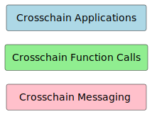

# Crosschain Protocol Stack

The [Crosschain DLT Interoperability Specification](https://entethalliance.github.io/crosschain-interoperability/draft_dlt-interop_techspec.html) is a formal definition of the implementation requirements for Enterprise Ethereum clients to achieve scalable crosschain communications.

The definition of the protocol stack, as indicated in the diagram, consists of three layers:

The Crosschain Application layer is designed to contain all business logic, while the Crosschain Function Call layer is required for executing functions across DLT networks and the Crosschain Messaging layer enables a trustless environment concerning transactions and events that are generated on one network and needs to be trusted on another network.

The design of the architecture, protocols, and interfaces is in alignment with the standards set by the Enterprise Ethereum Alliance (EEA), with the specifications defined in the three layers of the protocol stack.
