# What is Harmonia
Harmonia is a collaborative initiative under the Hyperledger Labs, focusing on the unique challenges and requirements of interoperable blockchain networks, especially within regulated environments. It serves as a repository and a communication platform, offering design documents, protocol definitions, and sample code to address interoperability issues in enterprise EVM blockchains, but not limited to these. Specifically, for R3's solution, the scope extends to include public EVM blockchains, thereby broadening its applicability and relevance in the wider blockchain ecosystem. In the following document when referring to the Atomic Swap CorDapp, we refer to R3's provided solution.
# What is a Cross Chain Atomic Asset Swap (Corda - EVM)
## Introduction

In the rapidly evolving world of blockchain technology, cross chain atomic asset swaps represent a significant milestone in achieving interoperability and fluidity across different blockchain platforms. This chapter delves into the concept of a cross chain atomic asset swap, with a specific focus on the integration between Corda Distributed Ledger Technology (DLT) and the Ethereum Virtual Machine (EVM) blockchain networks.
## Understanding Cross Chain Atomic Asset Swaps

### Definition

A cross chain atomic asset swap is an advanced procedure in blockchain technology, designed to enable the exchange of assets between different blockchain networks. This operation is atomic, meaning it functions as an all-or-nothing process. Although the swap comprises multiple steps, it is structured so that the entire transaction must either conclude successfully in its entirety or not occur at all. This design ensures that the transaction does not get stuck in any partially completed phase; it is either fully executed with both parties receiving their respective assets, or it is fully reversed, with all assets reverting to their original owners.
### Atomicity in Blockchain

The term "atomic" in this context borrows from the concept of atomic transactions in database systems, where a series of operations either all occur successfully or none occur at all. In blockchain, this ensures that the asset transfer is fully completed or fully reverted, eliminating the risk of partial completion.
## The Corda-EVM Cross Chain Swap

### Corda DLT Network

Corda is an open-source blockchain platform designed for business, known for its distinct features like privacy, security, and scalability. Unlike typical blockchains, Corda does not operate on a proof-of-work system, instead, it utilizes a unique consensus mechanism suitable for business applications.

### Ethereum Virtual Machine (EVM)

EVM, the computation engine of the Ethereum network, is responsible for executing smart contracts. It allows for the creation and execution of decentralized applications (dApps) on the Ethereum blockchain.

### The Swap Mechanism

#### Preliminary Agreement Phase

Prior to the initiation of the transaction, there is a crucial agreement phase. Here, two participants — let's call them Participant X and Participant Y — negotiate and agree upon the assets to be exchanged. Participant X has an asset on the Corda network, while Participant Y possesses an asset on the EVM network. They mutually decide on the terms of the swap, including the assets to be exchanged and the conditions under which the swap will occur.

#### Transaction Initiation

With the agreement in place, the transaction commences:

1. **Asset Commitment Draft on Corda**: Participant X, holding an asset on the Corda network, initiates the swap by drafting a commitment to transfer their asset to Participant Y or back to Participant X conditional to the transfer of the EVM asset.
2. **Asset Commitment on EVM**: Participant Y, who owns an asset on the EVM network, commits to transfer this asset either to Participant X or back to Participant Y. This commitment ensures that the asset will undergo a transfer.
3. **Asset Commitment on Corda**: Participant X, finalizes the Commitment Draft by signing and notarizing it.

#### Atomic Swap Execution

The execution of the swap is atomic, governed by contracts on both networks:

1. **Simultaneous Transfer**: The swap is structured to ensure that both asset transfers occur together. If any part of the transaction fails or does not meet the agreed-upon conditions, neither asset is transferred.
2. **Atomic Nature**: This setup guarantees no intermediate or partially completed states. The transaction is binary in its outcome: both assets are swapped, or the transaction is completely nullified.

#### Enhanced Security and Validation Mechanism

The atomic nature of the swap is secured and validated by:

1. **Use of EVM Transfer Event Proofs**: The protocol integrates proofs from EVM commitment transfer events, adding an additional layer of security and validation.
2. **Oracle Participation**: The transaction protocol involves oracles, which are selected during the agreement phase. These oracles are responsible for signing block headers upon request, providing a decentralized or authoritative method for validating the transaction and ensuring its integrity.
3. **Threshold Signatures**: The use of threshold signatures ensures that the transaction only proceeds when a predefined consensus among the oracles is reached, further enhancing the trustworthiness of the process.

## Advantages of Cross Chain Atomic Swaps

1. **Interoperability**: Facilitates interaction and transaction between different blockchain networks, enhancing usability and reach.
2. **Trustlessness**: Participants are assured of the integrity and execution of the swap without needing to place trust in each other or in a central authority unless desired.
3. **Reduction of Counterparty Risk**: Minimizes the risk that one party fails to fulfill their part of the transaction.

## Conclusion

The integration of a cross chain atomic asset swap between Corda and EVM enables seamless, secure, and efficient asset transfers across different blockchain networks. As the technology matures, it holds the potential to revolutionize the way assets are exchanged in the digital world, paving the way for a more interconnected and efficient blockchain ecosystem.

# Key Challenges Analysis and Action Plan

## Asset Hold-Up

Asset hold-up occurs in cross-chain asset exchanges when one party, after locking or receiving the asset from the other party on one blockchain, fails, delays, or refuses to reciprocate with the agreed asset transfer on the other blockchain. This situation arises because transactions on different blockchains cannot be executed simultaneously, creating an opportunity for one party to withhold their part of the exchange after receiving the asset from the other party.

### Prevention Plan

- Implement mechanisms to prevent asset lock-up, ensuring smooth transaction completion irrespective of individual participant actions.
- Design the exchange process to be autonomous, eliminating reliance on any specific party's actions or presence.
- Introduce safeguards against temporary network issues or malfunctions that could impede transaction progress.
- Distribute trust among a set of pre-agreed validators to mitigate the influence of malicious actors.
- Maintain a continuous exchange mechanism, independent of timeouts, to avert risks associated with incomplete transactions.
- Utilize Validators/Oracles to enforce predetermined exchange rules, allowing independent resolution even in cases of participant unresponsiveness.

## Avoiding Dependency on Time and Timeouts

It is of fundamental importance to avoid dependency from time and timeouts to:
- Ensure equitable exchanges, free from the pressure of time constraints.
- Provide operational flexibility, accommodating variable transaction times.
- Protect against temporary network failures or denial-of-service attacks.
- Eliminate the risk of incomplete transactions and potential asset loss.
- Allow for responsive adaptation to unforeseen events during the exchange.

Time-dependent solutions, such as Hashed-Timelock algorithms, introduce a heuristic element to exchange outcomes and should be avoided.

### Prevention Plan

Develop a cross-chain asset exchange algorithm that operates independently of time constraints.

## Trust Level

In transactions involving asset exchanges among multiple parties, the reliance on mutual trust should be minimized. The effectiveness and security of the exchange should primarily depend on verifiable and objective criteria, rather than subjective trust. This principle holds unless the nature of the transaction necessitates trust, such as in situations overseen or regulated by a recognized authoritative party.

In cross-chain asset exchanges, selecting an appropriate trust level is essential due to varying blockchain architectures. In centralized systems, like those using Proof of Authority, exchanges may be facilitated by the same authority that oversees block validation. Alternatively, in decentralized blockchains, the process could involve multiple validators, agreed upon by the parties. Here, a portion of these validators' approvals is needed to complete the transaction, reflecting the decentralized nature of the system. This approach adapts to the specific governance structure of the involved blockchain.

### Prevention Plan

The introduction of Validators/Oracles offers several advantages in attesting to events and transactions on external blockchains:
- Enable trustless transactions, removing the need for direct trust between parties.
- Ensure exchange completion, irrespective of participant availability or willingness.
- Accommodate different consensus mechanisms, from public to private blockchain networks.
- Enhance security by adhering to the agreed terms of the transaction.
- Support decentralization by eliminating single points of failure.
- Provide flexible governance models, suitable for public ledgers and Proof of Authority systems.
- Facilitate automated dispute resolution, streamlining the exchange process.
## Cross-Network Event Verification without Compatible Crypto Primitives

Cross-network event verification without compatible crypto primitives

| Blockchain  | Transaction Signing  | Transaction Hashing  |
|-------------|----------------------|----------------------|
| Corda 4     | ECDSA (secp256r1)    | SHA-256              |
| EVM         | ECDSA (secp256k1)    | SHA-3 (Keccak-256)   |

### Prevention Plan

- Establish a Pre-Swap Agreement on Validators: Parties agree on a specific number (N) of validators and a required subset (M, where M < N) for signature validation.
- Equip Validators with Dual Verification Capabilities: Validators should be adept at generating verifiable signatures for both the EVM Blockchain and Corda DLT.
- Implement Cross-Blockchain Signature Verification:
	- For EVM Blockchain: Validators provide signatures to authenticate a Corda transaction's notarization.
	- For Corda DLT: Validators verify the origin of EVM commit/claim events, ensuring they match the expected blockchain, contract, and transaction ID.
- Strengthen Trust and Security: This approach guarantees reliable verification of cross-network events, effectively bridging the gap created by incompatible cryptographic primitives in different blockchain systems.

# In-Depth Analysis of Cross Chain Atomic Swap Transactions

In this chapter, we go through an in-depth exploration of Cross Chain Atomic Swap Transactions, specifically between Corda and EVM (Ethereum Virtual Machine) networks. The complexity of these transactions necessitate a detailed understanding of their mechanics to appreciate their efficiency and security details.
## Introduction to the Corda-EVM Cross Chain Atomic Swap Diagram

At the heart of this analysis is a comprehensive diagram that encapsulates the entire process of a Cross Chain Atomic Swap between Corda and EVM. This visual representation serves as a tool for dissecting the steps and interactions that occur during the swap. This serves as a reference only and in the following sections, the flow will be analyzed in detail, step by step.

||
|:-:|
|*Simplified version of the diagram*|

|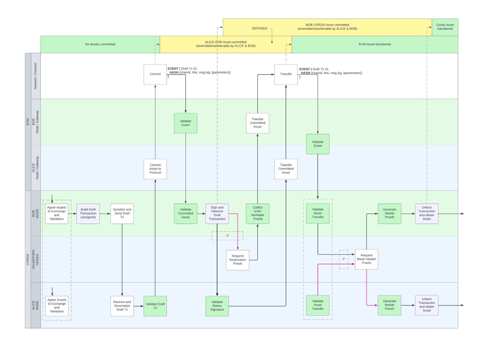|
|:-:|
|*Extended version of the diagram including gateways*|

## Cross-Network Communication Architecture of an Atomic Swap between EVM and Corda

This section presents an in-depth look at the architecture facilitating a cross-chain atomic swap between the EVM and Corda networks. The diagram below serves as a guide to understanding the key components and their interactions within this complex process.

|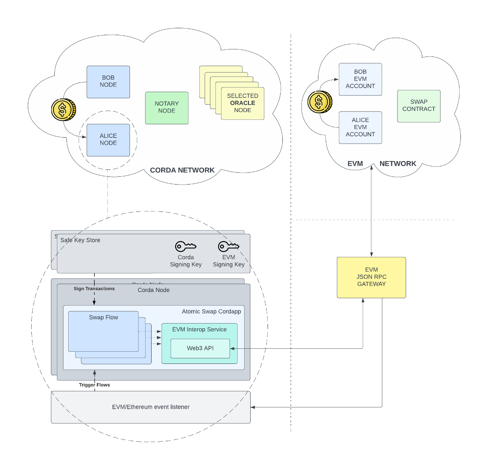|
|:-:|
|***Blueprint of EVM-Corda Cross Chain Communication***|

### Corda Network Components

- **Participants**: Within the Corda network, there are two primary participants: the asset owner and the asset recipient. These roles are crucial in initiating and completing the swap, although the swap completion can be fulfilled in the absence of one or the other party once started.
- **Notary Services**: One notary, agreed upon by the trading parties, is involved in the transaction, responsible for notarizing swap transactions. The choice of notary(ies) is a critical aspect of ensuring transaction integrity.
- **Oracles**: A predetermined number (N) of Oracles are selected, as agreed upon by the trading parties. These Oracles play a vital role in the process, particularly in allowing participants verifying and validating transaction conditions. The identity of these Oracles, their total number, and the minimum threshold for consensus are established in the pre-swap agreement phase.

#### On the role of the Oracles
Oracles play a crucial role in bridging the Corda and EVM blockchains by providing information about events on both networks. These oracles are implemented as Corda nodes with read-only access to the EVM blockchain network. They perform specific functions to verify and validate information from the EVM blockchain:

1. **Block Header Retrieval and Integrity Check:** Oracles can fetch block headers from a specific EVM chain based on a provided block number and chain ID. They then verify the cryptographic integrity of the block header to ensure its authenticity.
    
2. **Transaction Receipt Retrieval and Integrity Check:** Oracles can retrieve transaction receipts from a designated EVM chain for a given block number. They then calculate the Patricia Trie root of these receipts and compare it against the block header's stored receipts root to verify the integrity of the receipts.
    
3. **Signature Generation:** Upon successful completion of the integrity checks, Oracles generate their identifying signature over the block header hash. This signature serves as proof that the Oracle has verified the block header and receipts and is consistent with the EVM network's state.
    
Participants in cross-chain atomic swaps can leverage these Oracle signatures to establish consensus about the EVM blockchain's state. The Oracle signatures provide assurance that a sufficient number of witnesses agree on the blockchain's view. This consensus is essential for unlocking Corda assets based on events on the EVM blockchain.

Oracles also perform specific functions to prove Corda transaction notarization using EVM-compatible cryptography. This involves verifying that a specific Corda transaction ID was signed by a known Corda notary and then producing an EVM-compatible signature over the transaction ID and the notary identity using the EVM-compatible cryptography

Participants in cross-chain atomic swaps can then use these validated signatures as proofs to demonstrate that certain Corda transactions have been notarized on the EVM blockchain. These proofs enable participants to perform operations on the EVM network that are contingent on the notarization of Corda transactions.

In summary, Oracles serve as intermediaries, bridging the gap between the Corda and EVM blockchains. Their ability to verify and validate information from both networks enables participants to conduct cross-chain atomic swaps with confidence and ensure the integrity of transactions across the two ecosystems.

### EVM Network Components

- **Trading Identities**: On the EVM side, the two trading parties from the Corda network each have corresponding identities.
- **Helper Smart Contract**: A smart contract deployed on the EVM network facilitates the atomic swap, ensuring the synchronization and atomicity of asset exchanges across the two chains.

### Corda-EVM Interaction

- **Corda Node and CorDapp**: The representation under the Corda network includes a Corda node, an Atomic Swap CorDapp with Swap Flows. This setup illustrates how a Corda flow can execute functions and initiate transactions towards the EVM network using the EVM Interop Service.
- **EVM Identity and Signing Key**: The EVM identity of the Corda node is defined by its EVM Signing Key. This key is crucial for authenticating and securing transactions between the two networks.
- **Event Listening and Flow Triggering**: The Corda node is capable of listening to specific events on the EVM network, which can subsequently trigger corresponding flows within the Corda network.
#### Corda Node's EVM Identity Setup
Having to interact with the EVM network, transactions with the EVM network must be signed and therefore a private key is required which also constitutes the node identity on the EVM network. The Atomic Swap CorDapp includes flows that adds an EVM identity to the node and allows flows that sends EVM transaction to operate under the configured signing identity.

The integration of a Corda node with the Ethereum Virtual Machine (EVM) network hinges on the use of private keys. These keys serve both as a security measure and as the defining identity of the node within the EVM framework. The necessity for these keys arises from the requirement that all transactions on the EVM network be authenticated through signing.

In this setup, the Atomic Swap CorDapp allows the configuration of an EVM identity for the Corda node and also ensures that the node can conduct transactions on the EVM network under its configured signing identity, thus ensuring secure and authenticated transactions.

The CorDapp\s `UnsecureRemoteEvmIdentityFlow` flow can be used to initialize the EVM Identity, RPC endpoint, and Swap Protocol Address for a live node (CLI reference below) and is to be considered just as a refernce implementation for users to build their own, safer, EVM Identity initializer that does not expose the private key (e.g. using HSMs, WalletConnect protoco, etc).

```
@InitiatingFlow  
@StartableByRPC  
class UnsecureRemoteEvmIdentityFlow(  
    private val ethereumPrivateKey: String,  
    private val jsonRpcEndpoint: String,  
    private val chainId: Long = -1,  
    private val protocolAddress: String,  
    private val deployerAddress: String  
) : FlowLogic<Unit>() {  
    @Suspendable  
    override fun call() {  
  
        val identity = BridgeIdentity(  
            privateKey = ethereumPrivateKey,  
            rpcEndpoint = URI(jsonRpcEndpoint),  
            chainId = chainId,  
            protocolAddress = protocolAddress,  
            deployerAddress = deployerAddress  
        )  
  
        identity.authorize(this, ourIdentity.owningKey)  
    }  
}
```

```
flow start UnsecureRemoteEvmIdentityFlow ethereumPrivateKey: "0x…", jsonRpcEndpoint: "http://localhost:8545", chainId: 1337, protocolAddress: "0x…"
```

### Communication Infrastructure

- **Corda EVM Interop Service**: This service acts as a bridge between the Corda and EVM networks. It facilitates communication and transaction execution across the two chains.
- **EVM Json RPC Gateway**: The EVM Interop Service communicates with the EVM blockchain through an EVM JSON RPC Gateway, enabling data exchange and transaction coordination between these distinct blockchain systems.

The diagram accompanying this section visually illustrates these components and their interrelationships, providing a comprehensive overview of the atomic swap architecture between EVM and Corda networks.

## Step 1: Initial Agreement

|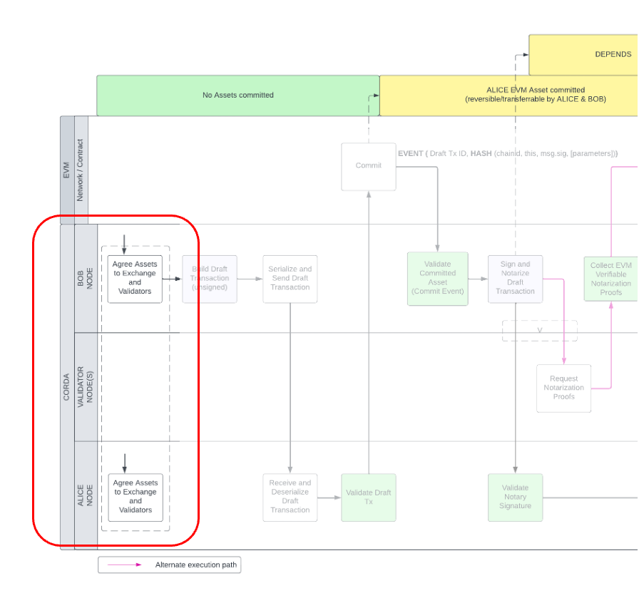|
|:-:|
|*Cross-Chain Atomic Swap - Agreement*|

Alice and Bob agree on what will be exchanged between the two on each network, including the specific assets and amounts. This agreement serves as the basis for the cross-chain atomic swap and ensures that both parties are committed to the same terms.

This step has dual implications:
- It enables both parties to predict the unique hash of the two distinct and mutually exclusive EVM events that would be generated if the agreed-upon EVM asset is claimed or reverted after being committed to the swap contract.
- It allows to condition the Corda asset's movements, contingent upon the reception of this unique EVM event with its unique hash, along with the proofs of its validity gathered through the agreed Oracles.

## Step 2: Corda Draft Transaction with Asset Lock

| 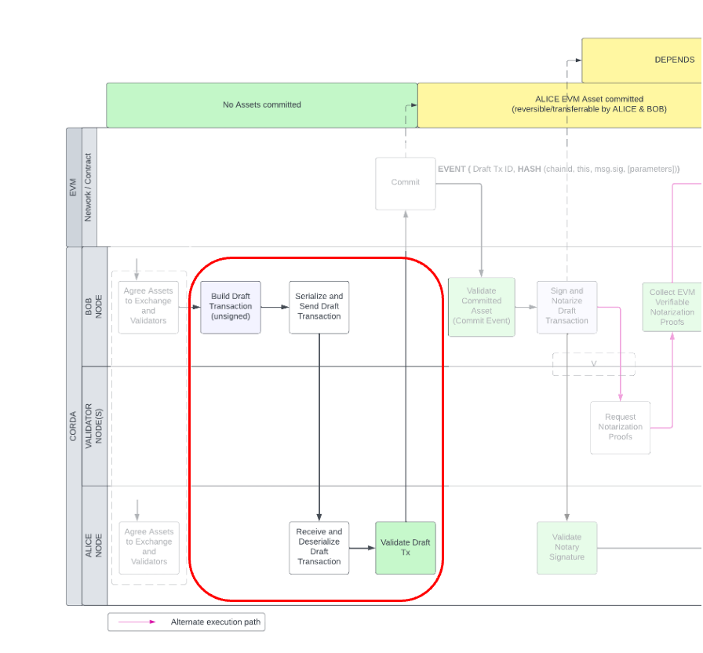 |
| :--: |
| *Cross-Chain Atomic Swap - Draft Transaction* |

After the Initial Agreement, when the participants decide to continue and want to initiate a cross-chain atomic swap, the Corda asset owner composes a Draft Transaction with two outputs:
- the asset state itself
- a lock-state

The Draft Transaction is then shared with the counterparty for validation and acceptance.

Once the Draft Transaction is thoroughly verified and accepted by the counterparty, this phase of the cross-chain atomic swap is complete. This step ensures that all parties have a clear and agreed-upon framework for the asset transfer, setting the stage for the actual execution of the swap.

### What are Draft Transactions

Draft transactions in Corda are preliminary representations of transactions that have not yet been finalized. They serve as working documents that allow participants in a distributed ledger network to collaborate on and agree upon the details of a transaction before it is submitted for consensus and execution. 

Draft transactions are mutable, meaning they can be modified and updated as necessary. This allows for iterative collaboration and consensus-building among participants and serve as the foundation for preparing transactions for consensus, ensuring that the finalized transaction accurately reflects the agreed-upon terms.

The code below is an excerpt of the code used to build a locking Draft Transaction, it takes the asset that needs to be locked, the N agreed Oracle identities, the signature threshold, and the Event encoder for the unlock events.

```
@CordaSerializable  
data class SwapTransactionDetails(val senderCordaName: Party,  
                                  val receiverCordaName: Party,  
                                  val cordaAssetState: StateAndRef<OwnableState>,  
                                  val approvedCordaValidators: List<Party>,  
                                  val minimumNumberOfEventValidations: Int,  
                                  val unlockEvent: IUnlockEventEncoder  
)

@InitiatingFlow  
class BuildAndProposeDraftTransactionFlow(  
    private val swapTxDetails: SwapTransactionDetails,  
    private val notary: Party  
) : FlowLogic<WireTransaction?>() {
...
}
```

### Role of Draft Transactions

While draft transactions are mutable, their cryptographic identity is unique and immutable. This means that once a draft transaction fulfills the agreed-upon terms and is accepted by all participants, its cryptographic identity (transaction hash) can be used to identify the agreed-upon transaction and ensure it is not altered. Additionally, signing and notarizing it does not alter the transaction or its unique identity. The signer's signatures, including the notary's signature, can be verified against the transaction's cryptographic identity.

Draft transactions, therefore, allows two or more participants to reach consensus on a draft transaction without actually committing any resource yet, and only later execute it and prove it's successfull execution by presenting the notary signature over the transaction's unique identity as a proof of irreversible execution.

### Role of the Lock-State

In Corda, a lock-state is a special type of state that is used to enforce certain conditions on the movement of another state. Lock-states are used to implement encumbrances, which are restrictions that can be placed on the transfer of assets or other data and are enforced by the notaries during notarization.

A lock-state is a state that contains a condition that must be met before another state can be consumed. For example, a lock-state could contain a condition that says that the asset can only be transferred to a specific party or that it can only be transferred if a certain proof is provided. In specific with the cross-chain atomic swap design, the encumbered asset can only move backward to the original Corda owner if a proof is presented about the EVM counterparty asset being reverted to the original EVM owner, or forward to the expected Corda recipient if a proof is presented about the EVM counterparty asset being transferred to the expected EVM recipient and new owner.

```
class LockState(val assetSender: PublicKey,  
                val assetRecipient: PublicKey,  
                val notary: PublicKey,  
                val approvedValidators: List<PublicKey>,  
                val signaturesThreshold: Int,  
                val unlockEvent: IUnlockEventEncoder,  
                override val participants: List<AbstractParty> = emptyList()) : ContractState
```

In the above data structure for the lock-state, the lock parameters are visible:
- `assetSender` and `assetRecipient` are used to identify the swap participants on corda where `assetSender` is the initial Corda asset owner and `assetRecipient` is the expected recipient identity in the Corda network;
- `notary` is the notary that will be enforced when notarizing the Corda asset transfer;
- `approvedValidators` is a number (N) of Oracles who's attesting signature will be used to identify their *view* of the blockchain for the block of interest.
- `signaturesThreshold` is the number (M) or the minimum number of attesting signatures (where M is less than or equal to N) required to support a participant when providing EVM asset transfer proof (claim or revert) through the unlock asset command.
- `unlockEvent` is the partially encoded EVM Event as it is expected due to the agreed swap parameters; all its parameters are pre-encoded while the swap-id, which is the Corda Draft Transaction ID, is only encoded during the unlock transaction verification because it is retrieved form the Draft Transaction outputs used in the new transaction inputs during the contract verification.

## Step 3: EVM Asset Commit

| 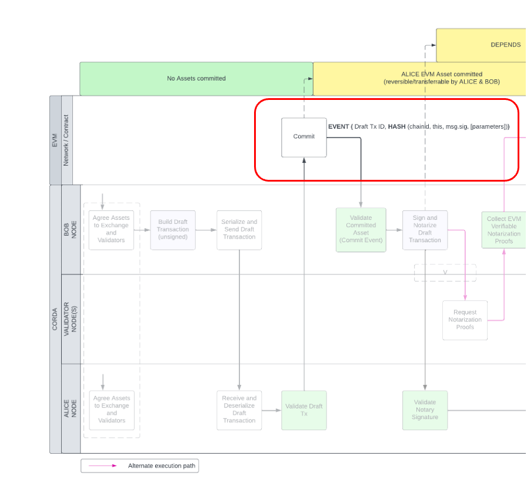 |
| :--: |
| *Cross-Chain Atomic Swap - EVM Asset Commit* |
|  |
| 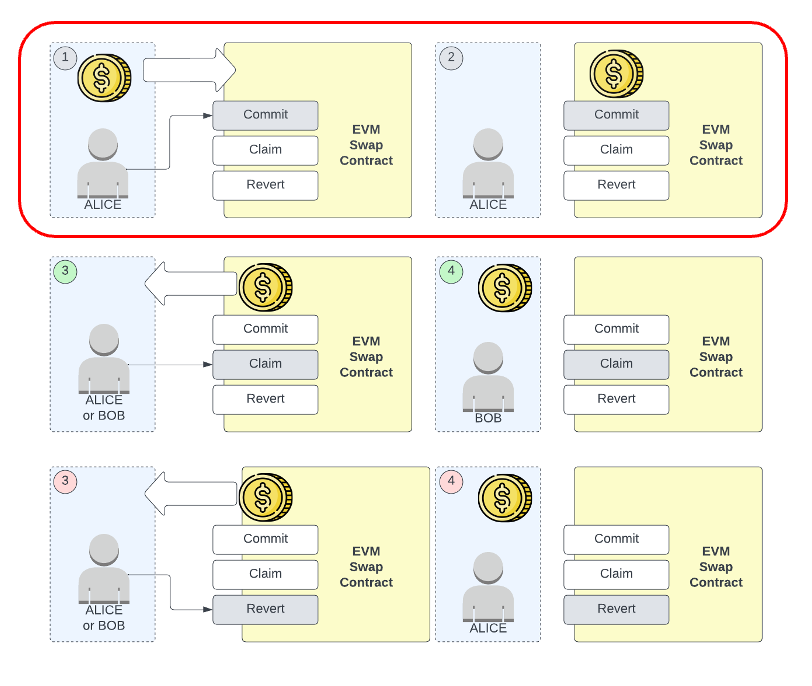 |
| *Cross-Chain Atomic Swap - EVM Asset Commit (Swap Contract)* |

Once the Corda Draft Transaction has been validated and accepted, the next step involves the recipient of the Corda Asset, who is concurrently the owner of the EVM Asset, moving forward to commit their EVM Asset to the Swap Contract. It is crucial to note that, up to and including this point, no resources have been irrevocably committed. The Corda Draft Transaction, until executed, essentially represents a promise that has not yet been fulfilled. In contrast, the commitment of the EVM Asset, while a significant action, is a definitive 'commit to transfer' but does not yet constitute an irreversible commitment of resources. Following this commitment, two mutually exclusive transfer paths become possible: the asset can either be returned to the original owner without any restrictions, or it can move forward to the designated recipient under specific conditions. These conditions include the requirement that the recipient must either be the EVM Asset owner or be the EVM Asset recipient and provide proof of notarization.

The aspect of observability in this process is essential because it ensures that a unique EVM event with a predictable and unique signature will occur. This is essential for ensuring the availability of a reliable and verifiable proof mechanism that can be used by an external system. The asset attached to the Draft Transaction discussed earlier, in fact, can only be consumed presenting proof that the predicted event happened and with the same two mutually exclusive transfer paths depending on which of the two possible events are proved.

Currently the EVM Swap Contract supports commit with the following token types: ERC20, ERC721, ERC1155. It can be easily expanded to support other types.

The `CommitWithTokenFlow` allows to interact with the EVM Swap contract to commit an asset of choice.

```
@StartableByRPC  
@InitiatingFlow  
class CommitWithTokenFlow(  
        private val transactionId: SecureHash,  
        private val tokenAddress: String,  
        private val tokenId: BigInteger,  
        private val amount: BigInteger,  
        private val recipient: String,  
        private val signaturesThreshold: BigInteger,  
	    private val signers: List<String>  
) : FlowLogic<TransactionReceipt>() {  
  
    constructor(  
        transactionId: SecureHash,  
        tokenAddress: String,  
        amount: BigInteger,  
        recipient: String,  
        signaturesThreshold: BigInteger  
    ) : this(transactionId, tokenAddress, BigInteger.ZERO, amount, recipient, signaturesThreshold, emptyList())  
  
    constructor(  
        transactionId: SecureHash,  
        tokenAddress: String,  
        amount: BigInteger,  
        recipient: String,  
        signaturesThreshold: BigInteger,  
        signers: List<String>  
    ) : this(transactionId, tokenAddress, BigInteger.ZERO, amount, recipient, signaturesThreshold, signers)
```

In the above code the primary constructor has the following parameters:
- `transactionId` - the identifier of the swap and must match the transaction ID of the Draft Transaction;
- `tokenAddress` - the deployment address of the token being committed;
- `amount` - the amount to committed;
- `recipient` - the EVM recipient should the Swap contract be subsequently executed successfully;
- `signaturesThreshold` - the agreed signatures threshold or in other words the minimum number of attestations;
- `signers` - the EVM identities of the agreed Corda Oracles whose signatures over the Draft Transaction ID - notary signature pair can prove the notarization of the Corda Draft Transaction if the recipient of the EVM asset wants to claim the EVM asset.
## Step 4: Notarization of Draft Transaction
 
| 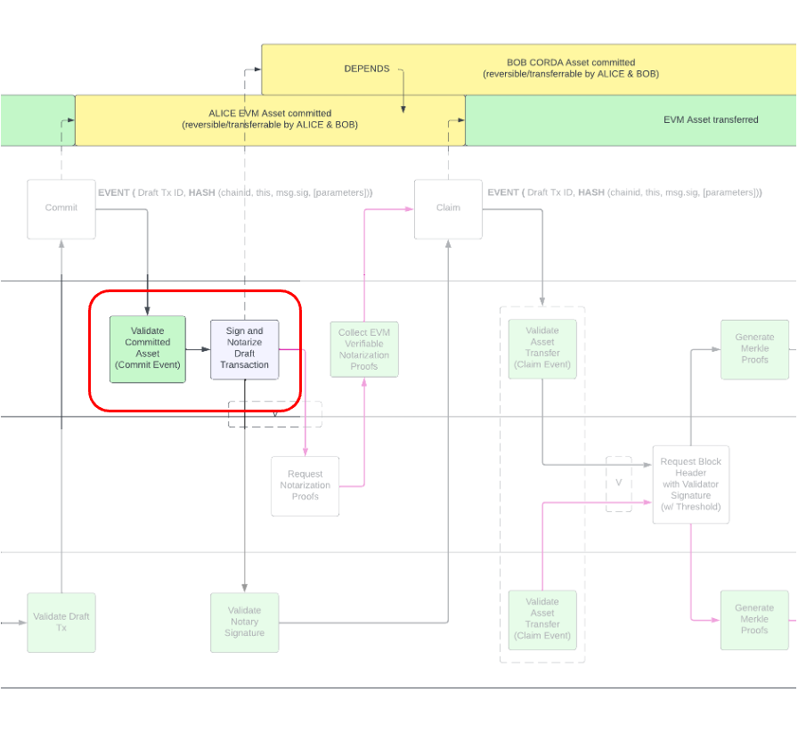 |
| :--: |
| *Cross-Chain Atomic Swap - Draft Transaction Notarization* |

Until now the Draft Transaction has been a useful promise:
- it allowed the two parties to preview and agree a Corda asset that would be transferred in exchange of an EVM asset;
- it's unique identifier has been used in the EVM Swap Contract when committing an EVM Asset;
- it references a Corda Asset and a lock-state that conditions the transfer of the Corda asset based on a future unique EVM event that is now inevitable;
- the conditioning of the transfer of the attached Corda asset ensures that a revert of the committed EVM asset allows the revert of the Corda asset;
- the conditioning of the transfer of the attached Corda asset ensures that a transfer to the recipient of the committed EVM asset allows the transfer to the recipient of the Corda asset;

Noting again that up to this point no resources have been irrevocably committed, obtaining the successful notarization of the Draft Transaction is a definitive 'commit to transfer' for the attached asset. Also worth noting, that for the notarization to succeed, either the Draft Transaction's referenced asset is still unconsumed or the Draft Transaction mints the state.

After notarization therefore, the Corda asset depends on the EVM asset, or more precisely on the ability to prove that the EVM asset was either reverted to the original owner or transferred to the programmed recipient. The system still holds the atomicity property all-fails / all-succeeds because:
- both the EVM asset owner and the EVM asset recipient are allowed to revert the committed EVM asset without restrictions, and subsequently revert the Corda asset by presenting the revert proof;
- both the EVM asset owner and the EVM asset recipient are allowed to transfer the committed EVM asset to the recipient with the only difference that the EVM asset recipient needs to provide proofs of notarization;
- both the EVM asset owner and the Corda asset owner can revert or transfer the locked Corda asset by providing EVM revert/transfer event proof.

The `SignDraftTransactionByIDFlow` allows to sign a Draft Transaction that was previously agreed between the participants.

```
@InitiatingFlow  
class SignDraftTransactionByIDFlow(  
    private val transactionId: SecureHash  
) : FlowLogic<SignedTransaction>() {  
  
   ...
}
```

In the above code the primary constructor has the following parameters:
- `transactionId` - the transaction ID of the Draft Transaction.

## Step 5: EVM Asset Claim or Revert

| 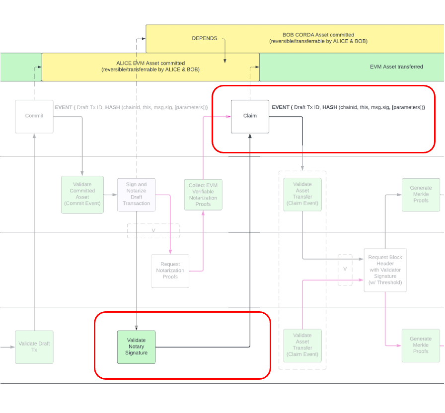 |
| :--: |
| *Cross-Chain Atomic Swap - EVM Asset Claim* |
|  |
| 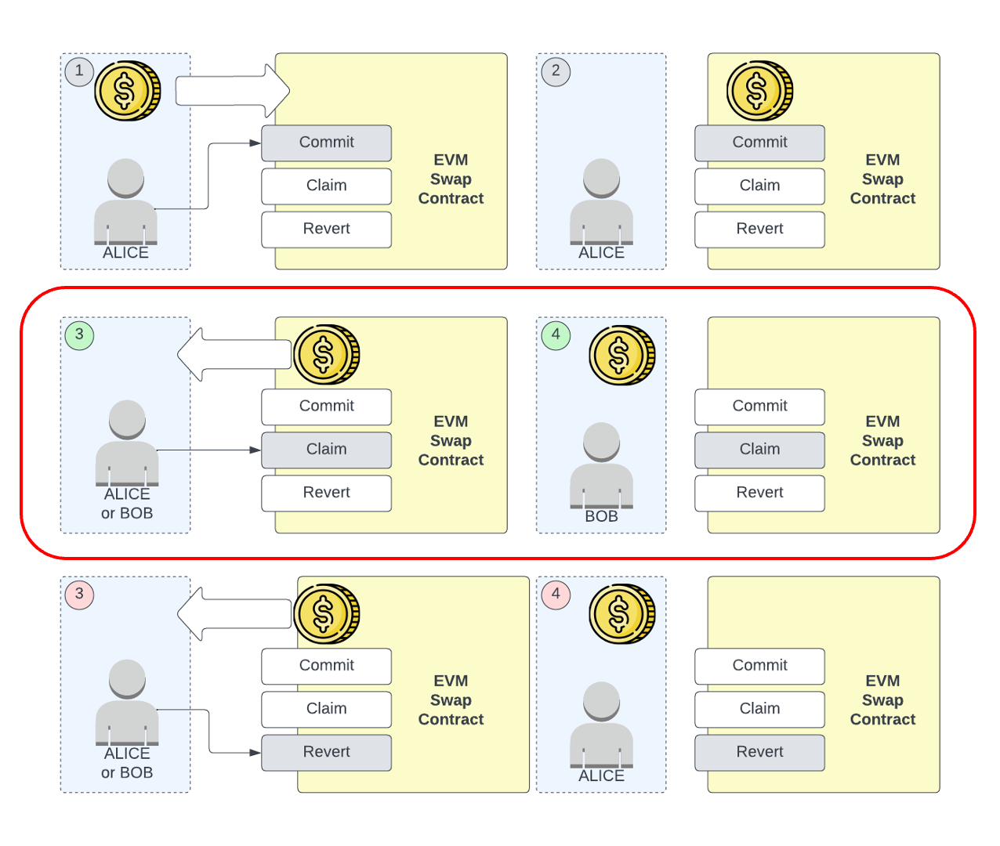 |
| *Cross-Chain Atomic Swap - EVM Asset Claim (Swap Contract)* |

At this stage the EVM asset is held by the Swap Contract, conditioned about its two possible transfer directions: either to the original owner (Revert) or to the recipient (Claim).
From the commit step, we know the asset was committed to the Swap Contract using the unique identifier of the agreed Draft Transaction, and the Revert/Claim function of the Swap Contract emit an event that is indexed by this unique identifier. In addition to the indexed identifier, the events emitted by the Swap Contract have a second parameter that is the hash of all the parameters of the committed asset including the blockchain identifier, all that were agreed in the initial swap phase.

In the code snippet below, the event unique id and parameters hash are used to both identify and validate the event so that it is unique per blockchain, asset, and parameters.

```
function claimCommitment(string calldata swapId, bytes[] memory signatures) internal {
    ...

    emit Transfer(swapId, commitmentHash(swapId)); // emit event
}

function revertCommitment(string calldata swapId) external {
    ...

    emit Revert(swapId, commitmentHash(swapId)); // emit event
}

function commitmentHash(string calldata swapId) public view returns (bytes32 hash) {
    Commitment storage commitment = _committmentState[swapId];

    if (commitment.status < 1) revert INVALID_STATUS(); // must be committed at least

    hash = keccak256(
        abi.encode(
            block.chainid,
            commitment.owner,
            commitment.recipient,
            commitment.amount,
            commitment.tokenId,
            commitment.tokenAddress,
            commitment.signaturesThreshold,
            commitment.signers // NOTE: probably requires sorting
        )
    );
}
```

When the claim function is therefore called successfully and the asset transferred to the expected recipient, the unique, expected, and unavoidable event is then caught by the CorDapp. The event holds the block number that mined the transaction that emitted the event, the transaction index in the block, and the event index in the transaction logs.
This means that it is possible to retrieve the Block form the EVM network, all its transaction receipts, the transaction receipt of the transaction that generated the event, verify the transaction contains the expected event (we knew how it would look like from the very early stages of the swap before the event happened) and verify the whole chain integrity and if satisfying use the proofs to unlock the counterparty asset.

In the case of revert, the process and the outcome is the same except for the fact that it will be used for the purpose of revert for the counterparty asset.

| 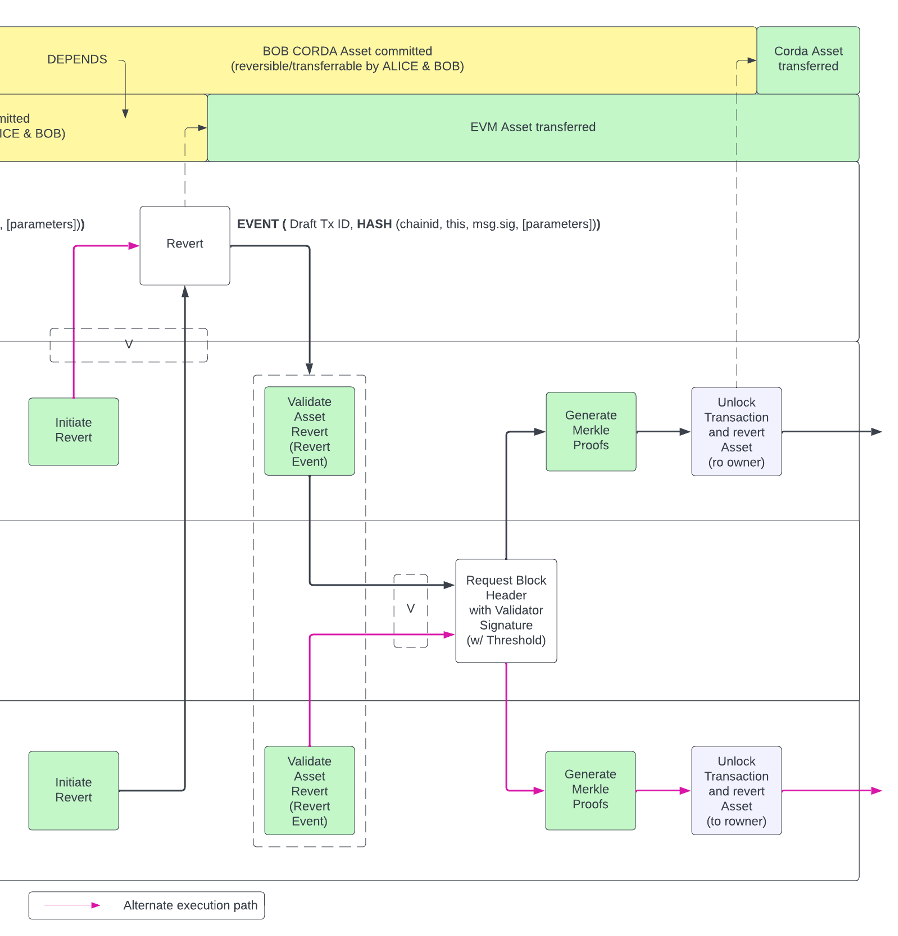 |
| :--: |
| *Cross-Chain Atomic Swap - EVM Asset Revert* |
|  |
| 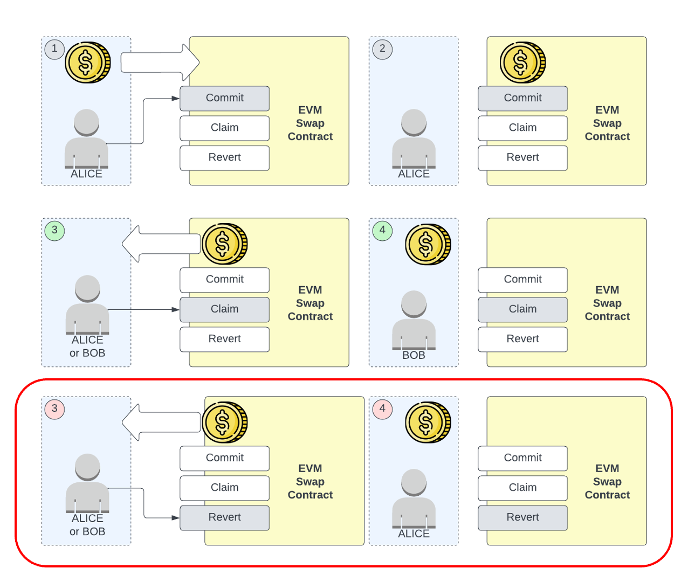 |
| *Cross-Chain Atomic Swap - EVM Asset Revert (Swap Contract)* |

When the EVM asset has moved out of the Swap Contract, either a Revert event or a Transfer event has been generated by the EVM transaction. In order to unlock the Corda Asset from the locking transaction, either the original owner or the recipient of the Corda Asset needs to prove on Corda that the EVM Event (Revert or Transfer) happened in an EVM transaction that was mined by the source EVM blockchain.

The two asset owners, or just participants, can initiate the Corda Asset unlock, and the first step is to retrieve the EVM transaction receipt. As mentioned earlier, the EVM Event contains the data about its transaction and its block, and therefore it is straightforward to retrieve the transaction receipt of the emitting transaction by querying the EVM blockchain. The transaction receipt contains the transaction logs (all the events in the transaction), and the EVM Event has an indexed Swap ID parameter matching the Draft Transaction ID, plus the hash of all the parameters and chain id that was pre-calculated in advance and stored in the locked transaction within the Corda Asset lock. This implies that, in order for a participant to unlock the Corda Asset, the Lock-State needs to receive an unlock command that holds the following information that will be verified internally by the Corda lock-state :
- The EVM transaction receipt;
- The EVM Block Header of the Block in which the transaction that emitted the event was mined;
- All the Block's transaction receipts;
- The Patricia Merkle Proofs generated from all transaction receipts in the EVM Block;
- The Oracles' signatures over the EVM Block header.

All these needs to be retrieved or elaborated based on the Claim/Revert EVM event.
## Step 6: Request Oracles / Validators Block Signatures / Validation

In the context of cross-chain atomic swap, using oracles offers specific advantages:

1. **Validation of External Events**: Oracles are crucial in verifying real-world events or states, which are essential for the accurate execution of the cross-chain atomic swap process in this system.
2. **Enhanced Security and Trust**: By incorporating oracles, we leverage an additional layer of security and trust. Oracles supports the validation of critical information like transaction receipts and block headers, ensuring the integrity and accuracy of cross-chain transactions.
3. **Decentralization and Reliability**: The use of multiple oracles can reduce dependency on a single point of failure, enhancing the reliability and robustness of the transaction process.
4. **Facilitating Cross-Chain Communication**: Oracles play a key role in bridging the gap between different blockchain networks, allowing for seamless and efficient cross-chain interactions.

In the initial phase of the Atomic Swap, parties agree on a number, N, of Oracles. This number depends on various factors, including the EVM blockchain's consensus algorithm. For instance, a Proof of Authority network might only require one Authoritative Oracle, whereas networks using Proof of Work or Proof of Stake might need a larger sample of nodes. Additionally, the parties decide on a minimum number, M, of Oracles that must concur to validate the EVM Event proofs. This threshold ensures a reliable and trustworthy verification process.

Consider a scenario where a swap participant produces valid proofs for an EVM event. They start by verifying the event in the transaction receipt logs, ensuring it meets expectations agreed and hardcoded in the Corda asset's lock-state. Next, they gather all transaction receipts from the block containing the event, using these to generate a Patricia Merkle Trie proof. This proof, when matched with the Receipts Root of the block, cryptographically confirms the block and transaction's integrity. However, to ensure this is the main blockchain branch and not a divergent reality, Oracles come into play. These Corda nodes, upon request, fetch the block header from the EVM blockchain, signing its hash and returning the signature to the participant. Accumulating at least M valid oracle signatures, along with the generated proofs, the participant can then execute the unlock command, releasing the Corda Asset.

In summary, oracles in the cross-chain atomic swap process are essential for ensuring security, trust, and seamless blockchain interoperability. They help validate external events and transaction integrity, reinforcing the swap's reliability. The initial agreement on the number of oracles, tailored to the blockchain's consensus mechanism, and their role in authenticating proofs, underscores their importance. This integrated approach with oracles not only enhances transaction validation but also complements the enforcement mechanisms of the Corda lock-state that governs the asset and ensures adherence to the agreed-upon atomic swap parameters.

## Step 7: Unlock Corda Asset from Notarized Draft Transaction

| 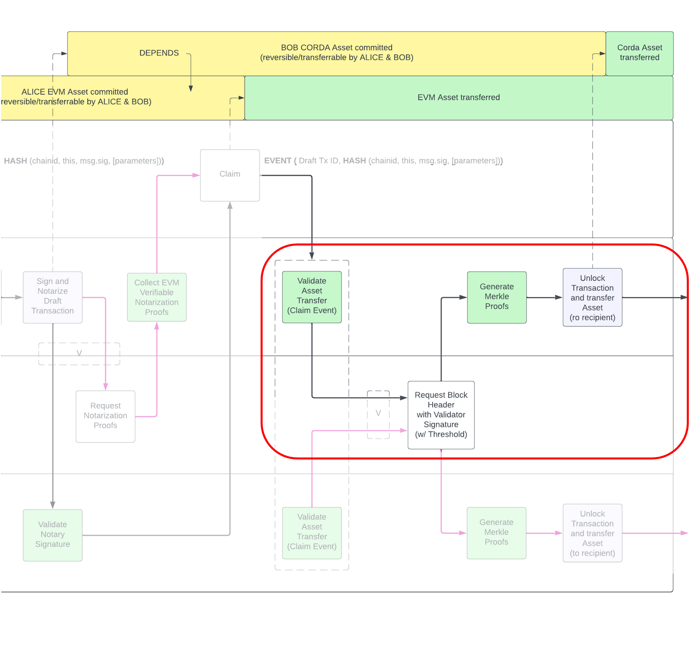 |
| :--: |
| *Cross-Chain Atomic Swap - Corda Asset Unlock* |
This is the last step of the swap, where the EVM asset has been claimed (or Reverted) and the participant that is about to unlock the Corda asset has the burden of generating proofs of the EVM event (Transfer or Revert). This process starts with requesting the Oracles to retrieve and sign the block header of the block that contains the transaction that generated the EVM event of the Claim (or Revert) function.

```
@Suspendable  
@StartableByRPC  
@InitiatingFlow  
class CollectBlockSignaturesFlow(  
    val transactionId: SecureHash,  
    private val blockNumber: BigInteger,  
    private val blocking: Boolean  
) : FlowLogic<Unit>() {
	...
}
```

This is a specially architected flow so that the signatures are returned in an asynchronous way and stored into a store so that later they can be retrieved by the unlock flow. This is to prevent unresponsive Oracles to (willingly or unwillingly) block the progress.

Once enough signatures (M <= N) are available, the participant can start producing proofs that will be passed to the new, unlocking transaction, to release the asset for its final destination (original owner if EVM event is Revert, recipient if EVM event is Claim).

```
@InitiatingFlow  
class UnlockAssetFlow(  
    private val transactionId: SecureHash,  
    private val blockNumber: BigInteger,  
    private val transactionIndex: BigInteger  
) : FlowLogic<SignedTransaction>() {  

    @Suspendable  
    override fun call(): SignedTransaction {  
  
        val signedTransaction = ...
        val outputStateAndRefs = ...
        val lockState = ...
        val assetState = ...
  
        val signatures: List<DigitalSignature.WithKey> = serviceHub.cordaService(DraftTxService::class.java).blockSignatures(blockNumber)  
  
        require(signatures.count() >= lockState.state.data.signaturesThreshold) {  
            "Insufficient signatures for this transaction"  
        }  
  
        val block = subFlow(GetBlockFlow(blockNumber, true))  
        val receipts = subFlow(GetBlockReceiptsFlow(blockNumber))  
        val unlockReceipt = receipts[transactionIndex.toInt()]  
        val merkleProof = generateMerkleProof(receipts, unlockReceipt)  
  
        val unlockData = UnlockData(merkleProof, signatures, block.receiptsRoot, unlockReceipt)  
        return subFlow(UnlockTransactionAndObtainAssetFlow(assetState, lockState, unlockData))  
    }
```

