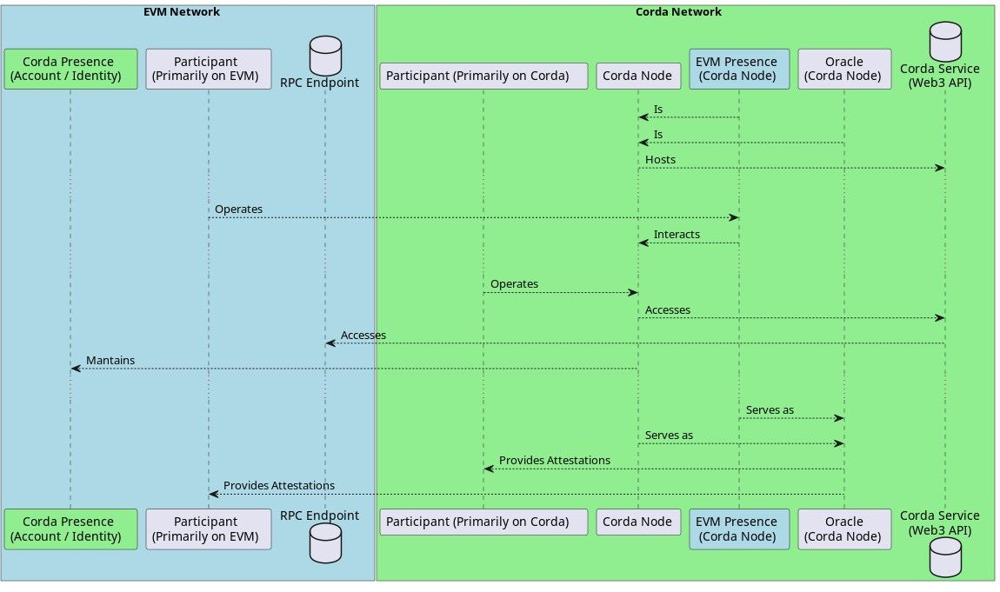

# Design: Cross-Chain Atomic Swap between EVM and Corda Networks

## Introduction
This design document provides an outline of an atomic swap protocol for the exchange of assets between Ethereum Virtual Machine (EVM) based blockchains and Corda Networks, where the assets remain on their ‘home’ networks at all times. The protocol accommodates scenarios such as Delivery versus Payment (DvP), where the delivery on Corda can be completed (or reverted) if and only if the EVM payment is completed (or reverted), or Payment versus Payment (PvP) scenarios.

It is intended as an example of a protocol that adopts the [architecture principles](architecture_principles.md) and [interoperability principles](../adhara/interop_principles.md), and respects the constraints, of regulated financial institutions, as elaborated in the documentation in the Harmonia repo.

## Business Overview

In what follows, we assume the model introduced in the [architecture documentation](beyondcandc.md). In particular, we assume the existence of two networks which, in this example, we will assume are a Digital Asset network on Corda and a digital cash network on Hyperledger Besu. Two participants, at some external venue, have agreed to a deal whereby one party will sell a digital asset to the other, in exchange for digital cash, and our job is to make this happen.

It is customary at this point to introduce names for these participants. However, our experience is that it proves almost impossible for the human brain to keep track of which role each of 'Alice' and 'Bob' are performing once one reaches the level of detail required in a design overview.  And so, in what follows, we try to be more explicit.

We will mostly refer to the 'asset seller' and the 'asset purchaser'. And, where it aids clarity, we will also refer to the participants in terms of which network holds their starting balance. 

In other words: 

* the 'asset seller' is the party which begins by holding value, in the form of a digital asset, on the Corda network, and which will end by holding digital cash on the EVM network.
* the 'asset purchaser' is the party which begins by holding value, in the form of digital cash, on the EVM network, and which will end by holding a digital asset on the Corda network.

## System Overview

The system consists of two networks, an EVM-based network and a Corda network. Each participant of the swap has a presence on both networks. 

This means that they each have access to a Corda node that they control and they have the ability to sign and send transactions to the EVM network. Importantly, we assume they also each have access to a Web3 RPC endpoint that is operated by a party they trust (which may in fact be themselves)

Finally, we assume that a party's Corda node has the ability (including the necessary network connectivity to connect to their trusted Web3 endpoint. In a production context, it is likely that such a connection would be proxied or subject to complex routing of some sort, but it doesn't change the analysis that follows.

### Capabilities of Corda Nodes
The Corda nodes can interact with the EVM network through RPC endpoints and Web3 APIs, enabling them to:

1.	Subscribe to EVM events.
2.	Trigger Corda flows in response to EVM events using filters and collecting event parameters.
3.	Create EVM transactions, execute EVM contract calls, execute Web3 API calls on the EVM Network RPC endpoint.
4.	Generate and validate Merkle proofs attesting a certain EVM event belongs to a certain block
5.  Query for evidence that a particular block has been finalised 
6. (Optional, to support non-PoA scenarios) Attest a block is final.
7. (Optional, to support non-PoA scenarios) Query other Corda nodes asking them to attest, by signature over the block header, that (in their view) a given block exists and is final. In this capacity, these queried nodes are known as Oracles.

### A note on terminology: Oracles, Witnesses and Validators

The protocol will rely on the involvement of several parties beyond the asset seller and asset purchaser. In particular:

* The Corda node needs the ability to query the EVM network to obtain a block and associated meta data. If another party on the Corda network provides this service, we refer to them as an _Oracle_. 

  * In a Corda network, any node can operate as an Oracle. To do so, it needs to host a Corda Oracle Responder Flow, which is capable of interacting with the EVM network's RPC Endpoint through Web3 APIs and executing the Oracle function. 
  * The Oracle function is straightforward—it queries a specific block on an EVM network when prompted by another Corda node initiating the Oracle Flow. This initiation process requires passing the block hash and the Blockchain ID parameters to the Oracle node.
* In cases where the finality status of a block can be determined directly by analysing the set of (Proof of Authority) identities that have signed it, we refer to these actors (who are members of the EVM netweork) as _Validators_.
* In cases where the finality status of a block cannot be determined directly (as is common in Proof of Work and some Proof of Stake networks), we may rely on the opinion or one or more other observers on the Corda network, which we refer to as _Remote Finality Guarantors_, or just "Guarantors" when the context is clear.
  * In such situations this service would be provided by extending the role of the Oracle so that it not only locates the requested block but verifies that it has reached finality. Assuming so, the Oracle signs the n-Tuple (blockchain id, block header, finality parameter) and returns the signature to the requesting party (blockchain id as per EIP-3220).
  * The architecture paper elaborates on potential models for the implementation of [remote finality guarantors](remote_finality_guarantors.md).

## Detailed Atomic Swap Protocol Flow
The atomic swap protocol involves a detailed series of steps for asset exchange. They are depicted graphically in the sequence diagram below, and then elaborated on in the text

_High level overview of the assumed network_

### Agreement
The atomic swap begins with an agreement between the two parties, where they have already agreed on:

* The expected recipient of the EVM asset - This is an Externally Owned Address (EOA) maintained by the asset seller.
* The EVM contract that facilitates the swap (swap contract for EVM asset commit and transfer)
* Either:
  * In the case of Proof of Authority, the identities of the _m_ EVM Validators, and a number _n <= m_ that must have signed a block for it to be considered final; _or_
  * When block finality is harder to determine, the identities of the _m_ Remote Finality Guarantors on the Corda network, with a number _n <= m_ that must attest the finality of a block for it to be considered final on the Corda network. 
    * An Oracle identity is in the form of a Corda Public Key, and an EVM address so that the Oracle is able to produce signatures that can be verified both on the Corda network and the EVM network as required.

### Draft Transaction Creation and Verification

Once the swap agreement is defined, the asset seller starts by building a Draft Corda Transaction that is then presented to the other party's Corda node for inspection. To proceed, asset purchaser must approve the Draft Transaction. Approval implies satisfaction that:

* The transaction, once committed, would transfer the agreed asset from the asset seller's Corda node to the asset purchaser's Corda node
* The lock parameters are correct and match the agreed conditions.

### EVM Asset Commitment

Upon approving the draft transaction, the asset purchaser signals their willingness to move forward, by committing the agreed EVM asset into the swap contract. 

The Commit parameters include the asset, the Draft Transaction ID, the Oracle identities, the signatures threshold M, and the signing Notary identity. 

__NOTE TO EDOARDO: Why does the EVM swap contract need to contain the identities of the Corda oracles or the signing threshold?__ 

The EVM Commit event generated by the Commit function is then received by the asset seller on the Corda network, who verifies it and validates it before notarising the Draft Transaction. Verification and validation is a required step because it ensures that once the Draft Transaction is notarised, it can be unlocked by the next and only EVM Transfer event.

Corda technical note: the Commit event can be verified by a flow, removing the restrictions present in the Transfer event verification that occurs within a ContractState. Therefore, there are no stringent requirements for validating the Commit event, allowing for flexibility in the verification process.

### Asset Locking and Reversion

Note that, until this point, no asset is truly locked. The Draft Transaction has not been notarised, and the committed EVM asset can be reverted at any time from the Commit state by either party. Reversion, in this case, means a Transfer of the cash from the swap contract back to the asset purchaser, which would trigger a Transfer event that can be used as proof to unlock the Corda asset in case the Draft Transaction was notarised.

### Forward Transfer of the EVM Asset

The EVM asset (the cash) can be transferred to the expected recipient under specific circumstances, involving either of the swap participants:

* The asset purchaser can initiate the forward transfer of the EVM asset at any time, without any restrictions. However, the expected course of action is for them to initiate the transfer after the notarisation of the Draft Transaction on the Corda network is detected. This allows for the unlocking of the corresponding Corda asset.
* The asset seller can also initiate the forward transfer of the EVM cash asset, but with a requirement. 

** NOTE TO EDOARDO: If the EVM contract is going to verify Corda signatures why not just verify the notary signature.   What value are the oracles adding here? **

* They must first gather at least M signatures from the selected Oracles, confirming that the Corda Draft transaction was notarised by the designated notary. 

* These signatures serve as a proof that allows to initiate the EVM forward Transfer transaction. This backup mechanism is in place to allow the completion of the swap in the event that the participant primarily on the EVM network becomes unavailable.

* In an ideal scenario, the EVM asset transfer process follows the first path, where the asset purchaser is responsible for the commit and transfer of the cash on the EVM network. However, to ensure uninterrupted completion of the swap and to avoid potential hold-up situations, the mechanism allows the asset seller to initiate the Forward transfer as well. This ensures a balance of power and maintains the overall efficiency of the asset swap process.

### Corda Transaction Unlocking

Once the Transfer event is received/detected, this can be used by either participant to unlock the notarised Draft Transaction and assign the Corda asset in the equivalent (ie opposite) direction it was transferred on EVM, either revert to seller or forward to purchaser. For the Corda transaction to be unlocked, its Lock state must be unlocked by providing an unlock command with at least the following properties/parameters:

* A Merkle Patricia Trie proof of the inclusion of the Transfer event in the transaction-block that generated it (proof length ~= log2(Number of transactions in the block).
* At least _n_ signatures of the block header from the _m_ identities that parametrise the lock state attesting that the block that generated the event is genuine and final
    * Note: these are either EVM signatures from the EVM validators, in the case of PoA, or Corda signatures, from the Remote Finality Guarantors when this is impractical.
* The block header transactionsRoot hash must match the Merkle Patricia Trie root hash.
* The Transfer event parameters must satisfy the Draft Transaction ID, the sender, and the recipient that parametrise the Lock state.
* The Locked Asset must move in the equivalent direction of the Transfer event (both forward to expected recipient, or both revert to initial sender).

* The Transfer event is verified by the Corda participant / flow that unlocks the Corda Transaction.

## Detailed Components of the Atomic Swap Protocol

Key components of the atomic swap protocol include:

### EVM and Corda Networks

These are the two blockchain networks where the atomic swap takes place.

### Participants of the Swap

Each participant has a presence on both networks.

### Corda Nodes

These are nodes on the Corda network operated by the participants. These nodes are capable of interacting with the EVM network via RPC endpoints and Web3 APIs accessible through a Corda service hosted by the node.

### Swap Agreement

This is the initial agreement between the participants outlining the terms of the atomic swap. The agreement includes the expected recipient of the EVM asset, the EVM contract facilitating the swap, and the identities of the Oracles.

### Draft Transaction
This transaction on the Corda network signifies a participant's intent to transfer the asset. It includes the transfer of the agreed asset from one participant to the other's Corda node, and all the swap parameters.

### EVM Commit and Transfer Events

These events on the EVM network signal significant actions in the atomic swap. The commit event signals the commitment of the EVM asset, while the transfer event signals the asset's transfer to the recipient. Both events include the draft transaction's ID and a unique hash of the agreed parameters.

### Asset Lock and Unlock Mechanism

This mechanism includes actions on both the EVM and Corda networks. The Corda asset is locked by notarising the Draft Transaction, meaning the outputs (Asset state and Lock state) are encumbered, thereby creating a locked asset at the output. 

The EVM asset is locked by committing it to the swap contract. However, in the context of the EVM asset, the term “lock' is used more liberally. It merely represents an intent to participate in the swap by earmarking the asset for use in this protocol (without affecting ownership). It's important to note that the committing party still retains the ability to withdraw their commitment by reverting the asset to themselves. This commitment only becomes irreversible if the swap is completed and the committed asset is transferred to the recipient of the swap.

Assets are unlocked by providing sufficient evidence and attestations, depending on the network. The only exception is for the asset purchaser on the EVM network, who never needs to provide evidence to revert transfer or forward transfer their own asset.

### Corda Transaction Model (UTXO)

Corda's transaction model is based on the Unspent Transaction Output (UTXO) model. Each transaction in Corda consumes existing states (inputs) and produces new states (outputs). This is distinctly different from the account-based model used in traditional banking systems, and in certain blockchain platforms like Ethereum, where balances are adjusted after each transaction.

The UTXO model's principal advantage is its inherent immutability, as each transaction output represents an independent fact on the ledger and the parallelisability that arises because every transaction explicitly specifies which parts of the ledger (which inputs) it is operating on. These transactions and states are evolved by being consumed and recreated in the context of a new transaction. This atomic use of inputs and outputs ensures data consistency and enhances the security of the Corda network. It's crucial for the atomic swap mechanism, as it allows for transactional certainty during the swap process across networks.

### Asset Locking in Corda

Asset locking in Corda is achieved through the use of a lock contract state, encumbered with the asset state. This means that they can only be spent together if certain predefined conditions, imposed by the lock-state, are met.

* **Lock-State**: The lock state imposes conditions that must be satisfied before an asset state can be unencumbered and thus spent. It could define parameters such as a specific time period during which the asset cannot be transferred, or specific parties who must sign a transaction.
* **Locked-State**: This refers to the asset state that is encumbered by the lock state. It is the state representing the asset that cannot be spent unless the conditions imposed by the lock state are met.
* **Encumbrances**: An encumbrance is a Corda mechanism used to ensure that any transaction that consumes a state also consumes another specific state, the encumbrance. In the case of asset locking, the lock state serves as the encumbrance to the locked state.

In the context of cross-network atomic swaps, asset locking provides a safeguard mechanism, ensuring that transactions can only complete if the conditions for the swap are met on both networks.

### Draft Transaction

Draft transactions are a critical feature for presenting a transaction preview that maintains the transaction ID after notarisation. This feature allows parties to inspect, and accept or reject the proposed transaction before it is finalised. The draft transaction serves as a mutual agreement or contract, allowing parties to stipulate the conditions under which they are willing to proceed with the transaction.

In the context of the cross-network atomic swap, the draft transaction would present a preview of the proposed swap, maintaining its transaction ID throughout the process. This ensures that all parties involved can inspect the transaction, thus facilitating transparency and trust in the atomic swap process.

In conclusion, these features collectively enable the cross-network atomic swap between EVM and Corda. The UTXO model provides transactional integrity, the asset locking and encumbrances ensure that the swap conditions are met, and the draft transaction functionality enables inspection and agreement on the proposed transaction, thereby ensuring transparency and trust between the involved parties.

## Assumptions

This design document makes several key assumptions:

* Both participants have operational nodes on both EVM and Corda networks and are capable of performing the required operations for the atomic swap.
* The Remote Finality Guarantors, if used, are trustworthy and reliable in their attestations, and _m_ of _n_ are operational and able to communicate between the EVM and Corda networks.
* Both the EVM and Corda networks are functional and reliable.

## Challenges and Risks

The atomic swap protocol between EVM and Corda networks faces a few challenges and risks:

* Smart Contract Bugs: Errors in the EVM swap contract could lead to loss of assets or failed swaps.
* Remote Finality Guarantor Trustworthiness: Where used, the protocol heavily depends on them for attesting to the finality of EVM blocks. If they  are compromised or act dishonestly, the integrity of the atomic swap could be jeopardised.
* Network Reliability: The protocol assumes that both the EVM and Corda networks are functional and reliable. If either network faces significant downtime or disruption, the atomic swap may fail or be delayed.
* Asset Compatibility: While the EVM network supports a wide range of standardised assets defined through Ethereum Improvement Proposals (EIPs), such as ERC-20, ERC-721, and ERC-1155, the protocol might require adjustments or extensions for other types of assets.

## EVM Asset Compatibility and Required Adjustments
   TODO

## Glossary
* EOA: Externally Owned Address
* EVM: Ethereum Virtual Machine
* RPC: Remote Procedure Call
* API: Application Programming Interface
* EIP: Ethereum Improvement Proposal
* ERC: Ethereum Request for Comments
* DvP: Delivery versus Payment
* M/N: Threshold Signature Scheme
* PvP: Payment versus Payment

## Conclusion

The atomic swap protocol between the EVM and Corda networks provides a robust and secure mechanism for asset exchange, mitigating the risk of one party failing to honour the terms of the agreement. Despite the inherent challenges and risks, careful design and execution of the atomic swap protocol, as described in this document, can ensure safe and efficient cross-chain asset swaps. This document should serve as a comprehensive guide for implementing the protocol in practice.
